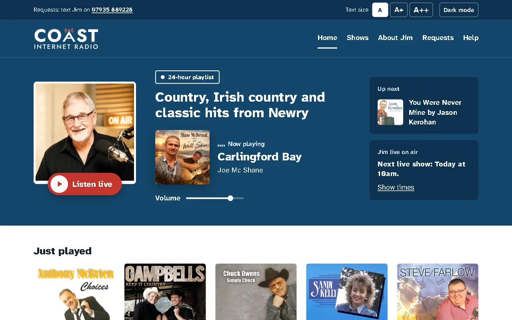

# Coast Internet Radio

[](https://github.com/JamieP-205/coast-radio/actions/workflows/test.yml)

The website for Coast Internet Radio, a small internet radio station in Newry run by Jim Parr, playing country, Irish country and classic hits 24 hours a day.



## Status

Live at [coastinternetradio.com](https://coastinternetradio.com). Jim can change the words, photos, colours, home page layout, announcements, news and show times himself at `/admin/`, without touching any code.

## How it's built

Plain HTML, CSS and JavaScript, with no framework, hosted on Netlify. The station's audio stream and track information come from two Cloudflare Workers that serve them over HTTPS.

The editor uses Netlify Functions for sign-in, saving and publishing, and Netlify Blobs to store Jim's changes and photos. The website is built with Jim's words already in the page, so it still works if the functions are down; anything he has published is laid on top.

```
public/              The website and the editor (/admin/), served as they are
netlify/functions/   One small function for each /api/ address
netlify/lib/         Sign-in, storage and the checks every change passes
scripts/             npm run hash-password, for setting the editor password
tests/               Unit tests, run with npm test
docs/                How to set up and use the editor
```

## Running it locally

```
npm install
npm test
npx netlify-cli dev
```

`netlify dev` serves the site and functions at http://localhost:8888. To sign in to the editor locally, put `ADMIN_USERNAME`, `ADMIN_PASSWORD_HASH` and `SESSION_SECRET` in a `.env` file (it's ignored by Git). See [docs/editor-setup.md](docs/editor-setup.md).

## How I use AI on this project

I'm building this step by step using my own knowledge, online sources and AI, which helps explain broken code while I make the changes and commit them. Commit messages will say if Claude Code contributed to code.
